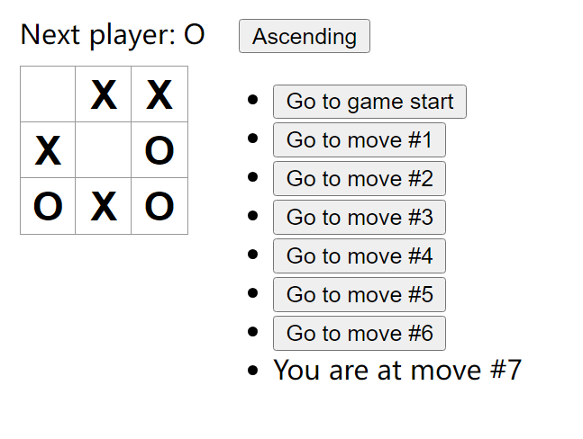

# React 官网

## 井字棋

- [x] 基础部分


- [x] 仅针对当前着手，显示“You are at move #…”而不是按钮。

```js
if (move === currentMove) {
  return (
    <li key={move}>
      <span>You are at move #{move}</span>
    </li>
  );
}
```


- [x] 重写 Board 以使用两个循环来制作方块而不是对它们进行硬编码。

```js
return (
  <>
    <div className="status">{status}</div>
    {Array(3)
      .fill(null)
      .map((_, row) => (
        /*使用 => () 的场景：

          返回单一表达式，逻辑简单。

          代码清晰时，能省略 return 提高可读性。*/
        <div className="board-row" key={row}>
          {Array(3)
            .fill(null)
            .map((_, col) => {
              /* 使用 => {} 的场景：

                函数需要多行代码处理。

                有其他逻辑需要执行（例如变量声明、条件判断等）。

                必须显式使用 return 返回值。 */
              const index = 3 * row + col;
              return (
                <Square
                  key={index}
                  value={squares[index]}
                  onSquareClick={() => handleClick(index)}
                />
              );
            })}
        </div>
      ))}
  </>
);
```


- [ ] 添加一个切换按钮，使可以按升序或降序对落子的步数进行排序。

````js
const [isAscending, setIsAscending] = useState(true);

const sortedMoves = isAscending ? moves : moves.slice().reverse();

<button onClick={() => setIsAscending(!isAscending)}>
  {isAscending ? "Ascending" : "Descending"}
</button>
<ul>{sortedMoves}</ul>
```



- [ ] 当有人获胜时，突出显示致使获胜的三个方块（当没有人获胜时，显示一条关于结果为平局的消息）。
- [ ] 在“落子”的历史列表中以 (row, col) 格式显示每步的位置。
````
